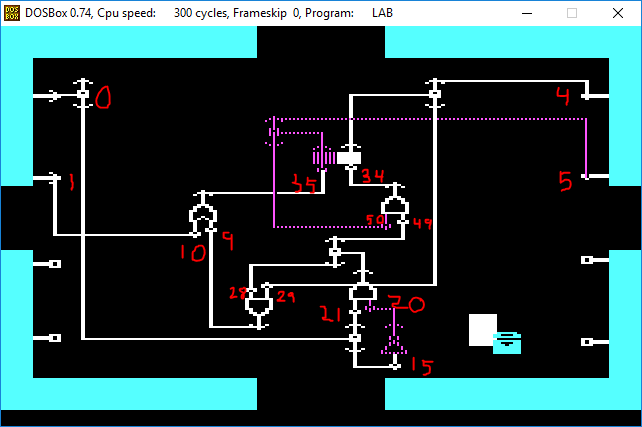

# Robot Odyssey Circuit Reader/Writer/Builder

This is a library for reading and writing circuit files (.CSV)
from the DOS version of the game [Robot Odyssey](https://en.wikipedia.org/wiki/Robot_Odyssey).

## History

I found the old game Robot Odyssey (1984) and started playing it. After playing for a bit, I discovered that the game supports saving and loading integrated circuits for the robots.
The in game controlls are kind of frustrating, and I was bored, so I decided to reverse-engineer the file format and build my own program for writing circuits for the game.
This is the result.

## Reading

The function `RobotOdyssey.Circuit.parseFile` parses a `.CSV`-file into a `Circuit`
which can then be "pretty"-printed using the function `printCircuit`.

For example, the following program (found in `examples/BasicRead.hs`):

    import qualified RobotOdyssey.Circuit as C

    main :: IO ()
    main = do
      readPrintFile "resources/circuits/builtin/RSFLOP.CSV"

    readPrintFile :: FilePath -> IO ()
    readPrintFile file = do
      circuit <- C.parseFile file
      C.printErrCircuit circuit

would result in the following output

    [Input (Ptr 0) O,Input (Ptr 1) O,Input (Ptr 2) O,Input (Ptr 3) O,Input (Ptr 4) I,Input (Ptr 5) O,Input (Ptr 6) O,Input (Ptr 7) O]
    Or (Input (Ptr 9) O) (Input (Ptr 10) O) [Ptr 35]
    Not (Input (Ptr 15) O) [Ptr 20]
    And (Input (Ptr 20) I) (Input (Ptr 21) O) [Ptr 49,Ptr 28]
    And (Input (Ptr 28) O) (Input (Ptr 29) O) [Ptr 9]
    Flop (Input (Ptr 34) O) (Input (Ptr 35) O) 0 1 [Ptr 29,Ptr 5] [Ptr 50,Ptr 4]
    And (Input (Ptr 49) O) (Input (Ptr 50) I) [Ptr 34]
    Wire {wireFrom = Ptr 0, wireTo = [Ptr 15,Ptr 21]}
    Wire {wireFrom = Ptr 1, wireTo = [Ptr 10]}

    Meta:
    [In,In,Neither,Neither,Out,Out,Neither,Neither]
    Length = 68

      RS Flip-Flop   
    1 Set      ^  Each time the set   
    2 Reset    ^  input is turned on, 
    3          ^  the two outputs     
    4          ^  switch (flipflop).  
    5          ^  Turning on the reset
    6          ^  input, resets output
    7 Output A ^  A to ON and output B
    8 Output B ^  to OFF.             

This is more or less a pretty printed version of the raw file format. No restructuring is done. The output can be understood as follows:
- The first line shows the inital state of all external inputs/outputs of the circuit.
- The lines after that shows a list of gates and wires. Each gate has a number of inputs and a list of outputs that are pointers to other inputs.
- After that comes a list of which external connections are input and which are outputs.
- The length in bytes of the first segment of gates and wires
- Documentation for the wire. Note that the numbers here are not the same as the internal format. 1-4 = Ptr 0 - Ptr 3, 5-8 = Ptr 7 - Ptr 4

In Robot Odyssey, the circuit looks like this. Red numbers are the `Ptr n` in the code above.

## Writing

Circuits can be written back to file using the function `RobotOdyssey.Circuit.saveCircuit`.

## Building circuits

There are two main ways of building circuits. Both are monadic builders, that should be used with `-XRecursibeDo`, which makes cyclic circuits possible.
### Builder
`RobotOdyssey.Circuit.Builder`, which mostly mirrors the original format, but simplifies generation of pointers and meta-data-generation. In this each gate-builder takes a list of of outputs as argument and returns pointers to its inputs.

Here is a program that generates the circuit above using `Builder`:

    {-# LANGUAGE RecursiveDo #-}
    import RobotOdyssey.Circuit
    import RobotOdyssey.Circuit.Builder

    -- | Sends out one tick a pulse when the wire goes from O to I
    edgeDetector :: Output -> Builder Output
    edgeDetector out = mdo
      i1' <- notGate O [i1]
      (i1,i2) <- andGate I O out
      return [i1', i2]

    -- | A toggle-flip-flop that switches state each time the input is pulsed
    tFlipFlop :: Output -> Output -> Builder (Output, Output)
    tFlipFlop outOff outOn = mdo
      (r2, reset) <- orGate O O [flopOff]
      toggle <- edgeDetector [andOff1, andOn1]
      (andOn1, andOn2) <- andGate O O [r2]
      (flopOn, flopOff) <- flopGate False (andOn2:outOn) (andOff2:outOff)
      (andOff1, andOff2) <- andGate O I [flopOn]
      return (toggle, [reset])

    -- | Run the builder above to actually generate a circuit.
    tFlipFlopCircuit :: Circuit
    tFlipFlopCircuit = buildCircuit $ do
      (toggle,reset) <- tFlipFlop [4] [5]
      newWire 0 toggle
      newWire 1 reset
      setInputState $ FL.fromFoldable' [O,O,O,O,I,O,O,O]

### BuilderSimple
`RobotOdyssey.Circuit.BuilderSimple`, which flips input and output, to the more intuitive version where a gate builder takes pointers to its inputs as arguments and returns a pointer to its output.

This version also supports direct nesting of circuits without using monadic bind, thanks to the `IsInput` type class.

Here is the same circuit again, this time using `BuilderSimple`:
 
    {-# LANGUAGE RecursiveDo #-}
    import RobotOdyssey.Circuit
    import RobotOdyssey.Circuit.BuilderSimple
    
    -- | Sends out one tick a pulse when the wire goes from O to I
    edgeDetector :: IsInput x => x -> Builder SPtr
    edgeDetector i1 = notOn i1 &-& i1

    -- | A toggle-flip-flop that switches state each time the input is pulsed
    tFlipFlop :: (IsInput x, IsInput y) => x -> y -> Builder (SInput, SInput)
    tFlipFlop toggle reset = mdo
      flopOff <- r2 |-| reset
      pulse <- edgeDetector toggle
      r2 <- pulse &-& outOn
      (outOn, outOff) <- flopOn /-/ flopOff
      flopOn <- pulse &-& outOff
      return (outOff, outOn)

    -- | A version of the above that uses nesting
    tFlipFlop' :: (IsInput x, IsInput y) => x -> y -> Builder (SInput, SInput)
    tFlipFlop' toggle reset = mdo
      pulse <- edgeDetector toggle
      (outOn, outOff) <- (pulse &-& outOff) /-/ ((pulse &-& outOn) |-| reset)
      return (outOff, outOn)

    tFlipFlopCircuit :: Circuit
    tFlipFlopCircuit = buildCircuit $ connectOut2 3 4 $ tFlipFlop (i 1) (i 2)

# Future work

- Generating images of the circuits with some kind of graph-drawing library would be really nice
- The code is kind of a mess. A cleanup and restructuring would be nice. Also, more comments.
- A simulator should be relatively easy to make and be quite cool.
- The pretty printer could be improved. Perhaps give code that uses BuilderSimple as output?
- Learn how to run haddock and improve the documentation.
- Tests. Parse(write(x)) == x, other properties and examples.

# Getting the game

Robot Odyssey can be found on various abandonware websites (for example [here](https://www.myabandonware.com/game/robot-odyssey-6g)). Run the game in [dosbox](https://www.dosbox.com/) and set the number of cycles to ~300 to get a reasonable speed.

